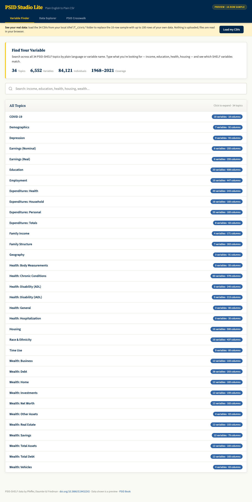

# psid-shelf-app

A browser-based catalog and explorer for the **PSID-SHELF** dataset — built to make one of social science's most powerful longitudinal datasets approachable for the rest of us.

🔗 **Live site:** [psid-shelf-app.netlify.app](https://psid-shelf-app.netlify.app)



---

## What this is

The Panel Study of Income Dynamics (PSID) has followed thousands of American families since 1968 — across generations, through every wave of social and economic change. The **PSID-SHELF** harmonized longitudinal file (Pfeffer, Daumler & Friedman, 2025) makes that data dramatically easier to use. But for newcomers, even the harmonized version can feel like a wall.

This app is a way in. It's a single-page browser tool with three tabs:

- **Variable Finder** — search 30 topic areas by plain language or variable name
- **Data Explorer** — preview what each topic's data actually looks like
- **PSID Crosswalk** — translate raw PSID variable codes into something readable

It runs entirely in your browser. No accounts, no installs, no servers.

## Two versions: the catalog and SHELF Studio

The `index.html` in this repo (and the live site) shows **10-row previews** of each topic — enough to understand the structure and decide whether SHELF is right for your project, but not analytically usable.

**SHELF Studio** (`shelf-studio.html`) is the full version. Load your own SHELF CSVs directly in the browser and get up to 100 rows per topic, all 30 topics, fully interactive. Nothing is uploaded anywhere.

To use SHELF Studio you need to download SHELF yourself from OpenICPSR (free; registration required). SHELF's terms don't permit redistribution, so this repo provides the tool, not the data.

## Getting the full data (the recipe)

1. **Register and download SHELF** from OpenICPSR:
   [doi.org/10.3886/E194322](https://doi.org/10.3886/E194322)
   You'll get a Stata `.dta` file.
2. **Run the splitter notebook** ([`PSID_SHELF_Topic_Splitter.ipynb`](PSID_SHELF_Topic_Splitter.ipynb)) — it reads the .dta and writes 30 topic CSVs into a folder of your choice. The notebook contains the full topic-to-variable mapping and verifies expected columns before writing. Takes about 5 minutes end to end.
3. **Open `shelf-studio.html`** in any modern browser — no server needed.

   A yellow **Load Full Data** strip appears just below the header. Click **"Load my CSVs"**, select the 30 topic CSVs the splitter produced, and the app reads them entirely in-browser via [PapaParse](https://www.papaparse.com/) — nothing is uploaded anywhere. Once all files are recognized, the header badge switches from gold to green and each topic shows up to 100 rows of real data instead of the built-in 10-row previews.

For variable definitions and topic structure, see the [PSID-SHELF User Guide](https://www.openicpsr.org/openicpsr/project/194322).

## Local use

```bash
git clone https://github.com/JF11579/psid-shelf-app.git
cd psid-shelf-app
open index.html   # or just double-click it
```

That's it. `index.html` is self-contained — previews baked in, nothing to install. `shelf-studio.html` is the same but built to load your own data.

## Attribution

PSID-SHELF was created by:

- **Fabian T. Pfeffer**, Ludwig-Maximilians-Universität München
- **Davis Daumler**, University of Michigan
- **Esther Friedman**, University of Michigan

Cite the dataset as:
> Pfeffer, Fabian T., Daumler, Davis, and Friedman, Esther. *PSID-SHELF, 1968–2021: The PSID's Social, Health, and Economic Longitudinal File (PSID-SHELF), Beta Release.* Ann Arbor, MI: ICPSR [distributor], 2025-02-24. https://doi.org/10.3886/E194322V2

This app is an independent project. It is not affiliated with or endorsed by the SHELF team or the PSID.

## Related

- **The PSID Book** — a longer-form companion at [joe-foley.gitbook.io/psid-book](https://joe-foley.gitbook.io/psid-book)
- **Analysis notebooks** — [PSID_For_the_Rest_of_US](https://github.com/JF11579/PSID_For_the_Rest_of_US)

## License

The code in this repository is released under the MIT License (see `LICENSE`). This license covers the app code only — the underlying PSID-SHELF data is governed by ICPSR's terms of use.

---

*Built by [Joe Foley](https://github.com/JF11579). Issues and pull requests welcome.*


